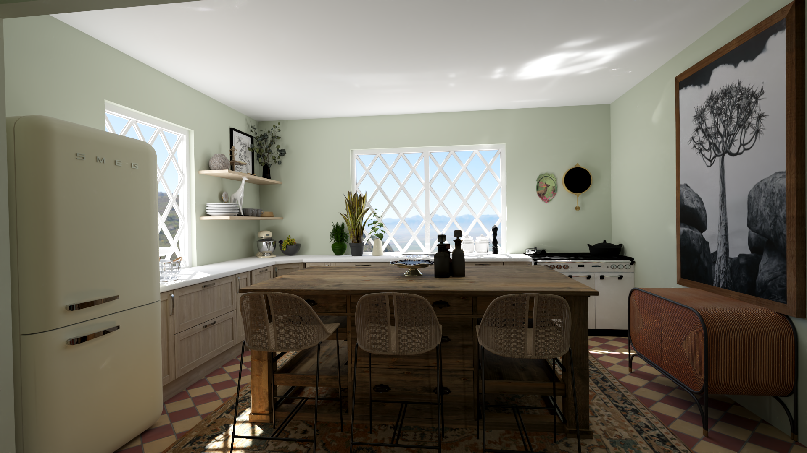
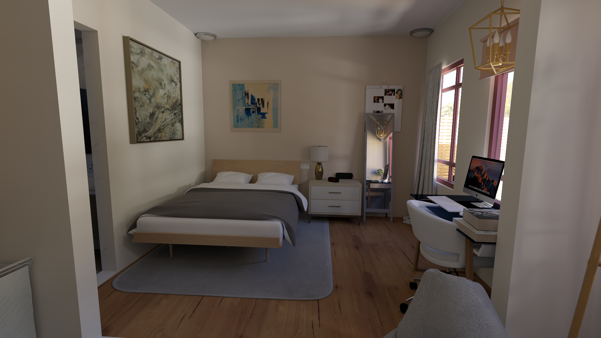

RLpbr: Physically Based Rendering for<br/>Reinforcement Learning
============================================================

This project is a work in progress high-performance ray tracing based renderer for reinforcement learning (RL).

**Features**:
* Path Tracing backend for physically based light transport simulation:
    * Soft Shadows
    * Global Illumination
    * Transparency
    * Reflections
* Direct lighting only backend designed for maximum performance at the cost of visual fidelity
* Batch rendering API (render many observations simultaneously)

 RLpbr is an evolution of the renderer described in _Large Batch Simulation for Deep Reinforcement Learning_ (ICLR 2021): [github.com/shacklettbp/bps3D](https://github.com/shacklettbp/bps3D). While the project's main focus is on enabling physically based dynamic lighting in interactive environments, RLpbr also can be used as a replacement for bps3D in scanned 3D environments like Matterport3D and Gibson. Due to the ray tracing acceleration hardware on modern GPUs, performance can be up to an order of magnitude faster than the already state of the art performance available from bps3D.


Examples
--------

**Path Tracing Mode**:
 


Integration
-----------

RLpbr is designed to serve as the renderer for a larger training system (or any system that needs high-performance rendering). We are actively looking for new users interested in using RLpbr in their projects! The small utilities in `rlpbr/bin` provide an outline of the basic API, as well as the classes and functions in `include/rlpbr.hpp`. However, since the project is still in active development, we highly recommend you contact us directly (bps@cs.stanford.edu), and we can discuss actively helping with any integration efforts, as well as any new features that may be of use.

Dependencies
------------

* CMake
* OpenImageIO
* ISPC
* NVIDIA GPU
* CUDA 10.1 or higher
* NVIDIA driver with Vulkan 1.2 and `VK_KHR_ray_query` support (if in doubt use latest available)
* Vulkan headers and loader (described below)

The easiest way to obtain the Vulkan dependencies is by installing the latest version of the official Vulkan SDK, available at <https://vulkan.lunarg.com/sdk/home>. Detailed instructions for installing the SDK are [here](https://vulkan.lunarg.com/doc/sdk/latest/linux/getting_started.html), specifically the "System Requirements" and "Set up the runtime environment" sections. Be sure that the Vulkan SDK is enabled in your current shell before building.

Building
--------

A standalone copy of RLpbr can be built for experimentation purposes as follows:
```bash
git clone --recursive https://github.com/shacklettbp/rlpbr
cd rlpbr
mkdir build
cd build
cmake -DCMAKE_BUILD_TYPE=RelWithDebInfo ..
make
```

Tools and examples will be built in `rlpbr/build/bin/`

Scene Preprocessing
-------------------

RLpbr requires scenes to be converted into a custom format before rendering. The repository includes a tool for this purpose in `bin/preprocess.cpp` that can be used as follows:

```bash
./build/bin/preprocess src_file.glb dst_file.bps right up forward texture_dir --process-textures
```

This command will convert a source asset, `src_file.glb`, into RLpbr's custom format: `dst_file.bps`. The next three arguments (`right`, `up`, `forward`) describe how the coordinate axes of the source asset are transformed. Finally, `texture_dir` specifies that `dst_file.bps` will be written to expect textures to be in the `texture_dir` directory. The optional `--process-textures` argument tells `preprocess` to also preprocess any textures that are embedded in `src_file.glb` and write them to `texture_dir`.

The only currently supported input format is GLTF, although asset importing is decoupled from the overall project and can easily be extended.

Basic Usage
-----------

 * 3D Fly Camera: `./build/bin/fly scene_file.bps [SAMPLES PER PIXEL] [PATH TRACER DEPTH]`
 * Benchmarking: `./build/bin/singlebench scene_file.bps BATCH_SIZE RESOLUTION [SAMPLES PER PIXEL] [PATH TRACER DEPTH]`
